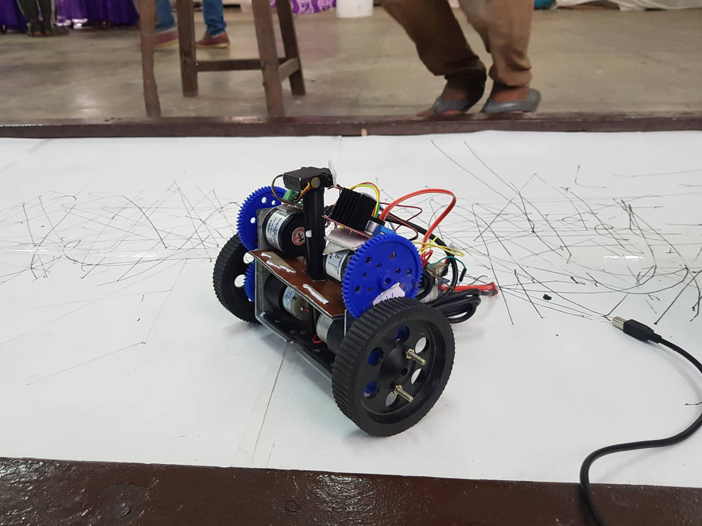

# Curve-Sketching-Bot

## Abstract:
The aim of this project was to create a bot which can sketch any curve on a plain surface. 

## Acknowledgement:
We would like to express our special thanks to our mentors Abhimanyu Bambhaniya Sir(ECE 3rd year), Bhaskar kaushik Sir(EE 4th year) and Jashan Singh Sir(BT 4th year) as well as our guide and senior mentor Shivam Shrivastava Sir(EE 4th year & secretary, Models and Robotics Section) who gave us the golden opportunity to do this wonderful project and made your work easy and fun to do. Special Thanks to him for his exemplary guidance, monitoring and constant encouragement throughout the Project. I would also like to thank all mentors as they helped us a lot in finishing this project within the limited time although being too busy for the Robocon 2018 project.

## Pre-Requisites:
- 1 x Arduino Mega
- 2 x dc-gear-motors
- Jumper wires
- 1 x 5 Volt Regulator(7805)
- 1 x 11.1V 2200 mah LiPo Battery
- 3D printed parts
- 2 x differential wheel
- 1 x metal ball caster
- 4 x gear
- 2 x rotary encoder(600ppr)
- Zip Tie
- Aluminium Rubber Composite

## Work:
We had made a three wheel differential bot which can sketch any curve given to it. At first we have decided to make that bot operate by the help of programmable calculator but then we found another way to move a general curve. We have gone through a series of desgin change. Each desgin change made it mechanically better. Last two desgin of our chasis are available above.

In the first design encoder were on the outer side of the bot as encoders are sensitive so we have changed the position of encoder from outer side to inner side of the bot and we have used gear to couple encoder with motor shaft.

The curve that bot sketch's should be entered in the code or user can send coordinates of the point serial to make a complete figure.

## Future improvements:
One more sensor like gyro or magnetometer should be used to make it presize because we were not able to find out sliping of wheel

Paint brush can be used other than pen so that bot will be able to sketch on any kind of surface.

## Team Member:
1. Vedant Neekhra
2. Yashraj jariwala

## Mentors:
1. Daattavya Aggarwal
2.Anant Shandilya
